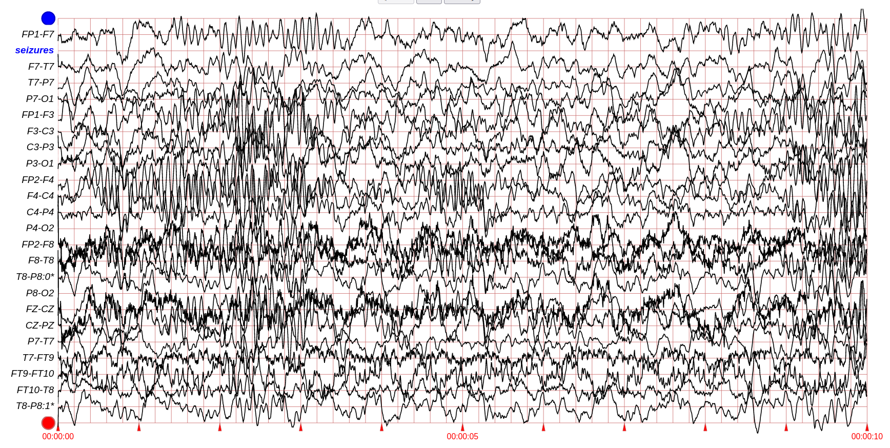

# Winter School Lab Session : Use Case 13

In this folder you can find the contents for the Use Case 13 laboratory session. 

## Overview

The Use Case 13 of the DeepHealth project is focused in Epileptic Seizure Detection with Elecroencephalogram (EEG) recordings.
EEG recordings are continuous signals composed by many different channels.
Each channel is associated with a pair of electrodes which are placed in the scalp.
Each pair of electrodes measures the potential difference between two regions of the scalp to monitor brain activity.
Next picture shows an example of a 10-seconds extract of an Electroencephalogram. At the left side, we can see the labels of the different channels.

## Dataset
The dataset which is going to be used for this lab session has 247 recordings, associated to 8 pediatric subjects.
This is a subset of the [CHB-MIT Scalp EEG Database](https://physionet.org/content/chbmit/1.0.0/) from [PhysioNet](https://physionet.org/), which contains 24 subjects.

## Exercises for the laboratory session
Below you can find the guides to follow in order to carry out the experimentation related to Use Case 13.
- [Pipeline preparation](00_pipeline_preparation.md): First step is to download the dataset and the code.
Before this step, you must have the two libraries PyECVL and PyEDDL installed
(you can see how to do it [here](https://github.com/deephealthproject/winter-school/blob/main/lab/01_installation/pyecvl_pyeddl_conda_install.md)).
- [Run test recurrent example](01_run_test_inference.md).
- [Run complete experiments with the recurrent approach](02_run_recurrent_experiments.md).
- [Run complete experiments with the convolutional approach](03_run_cnn_experiments.md).
